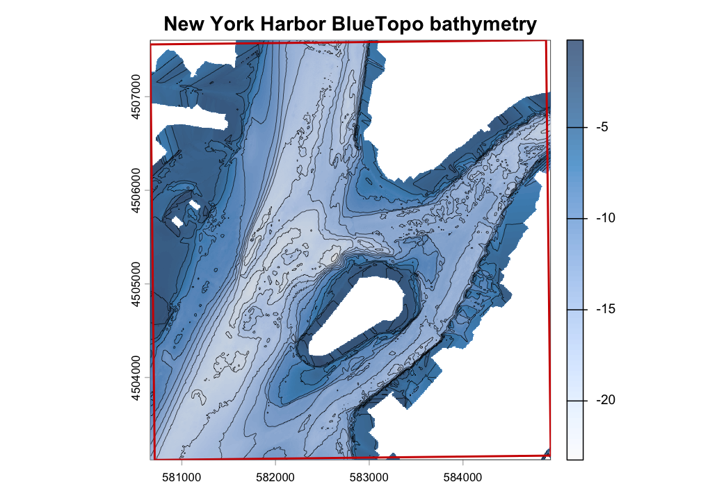

# bluertopo

[](https://github.com/el-cordero/bluer-topo/actions/workflows/R-CMD-check.yaml)
[](https://github.com/el-cordero/bluer-topo/actions/workflows/pkgdown.yaml)
[](https://github.com/el-cordero/bluer-topo/blob/main/LICENSE.md)

`bluertopo` discovers, downloads, verifies, and opens National Oceanic
and Atmospheric Administration (NOAA) BlueTopo bathymetry for an area of
interest using `terra`. The package keeps source GeoTIFF and RAT sidecar
files intact by default, records query and catalog provenance, and makes
native source-resolution choices explicit.

BlueTopo is not for navigation. This package performs no vertical-datum
conversion and is not affiliated with, endorsed by, or supported by
NOAA.

Reference: NOAA,
[BlueTopo](https://nauticalcharts.noaa.gov/data/bluetopo.html) and
[BlueTopo
specifications](https://nauticalcharts.noaa.gov/data/bluetopo_specs.html).

## New York Harbor example

This example demonstrates tile discovery, verified asset retrieval, and
bathymetry extraction for New York Harbor. The area includes portions of
Lower Manhattan, Governors Island, Upper New York Bay, and the East
River entrance.

<div class="figure">


<p class="caption">

BlueTopo bathymetry for New York Harbor, displayed with hillshade,
contours, and the example-area boundary.
</p>

</div>

| Example area | Selected tiles | Native resolution | Retrieved assets | Verification |
|:---|---:|:---|:---|:---|
| New York Harbor | 2 | 4 m | 2 GeoTIFFs and 2 RAT files | SHA-256 verified |

## Basic workflow

``` r
library(bluertopo)

aoi <- vect("my_area.gpkg")
bathy <- bluertopo(aoi)
plot(bathy)
```

`sf::sf` and `sf::sfc` polygon objects with a known CRS can also be
passed directly to `bluertopo()`, `bluertopo_tiles()`, and
`bluertopo_download()`.

| Function | Returns |
|:---|:---|
| `bluertopo_tile_polygons()` | Every current BlueTopo tile polygon; no AOI required |
| `bluertopo_tiles(aoi)` | Selected tile footprints and metadata as a `terra::SpatVector` |
| `bluertopo_download(aoi, path)` | Verified source-asset records as a data frame |
| `bluertopo(aoi)` | A `terra::SpatRaster` or `terra::SpatRasterCollection` |

## Provenance workflow

``` r
result <- bluertopo(aoi, details = TRUE)

result$tiles
result$downloads
result$coverage
result$provenance
```

## Examples

The [Examples tab](articles/examples.html) uses NOAA BlueTopo source
tiles for New York Harbor. Normal package tests use small synthetic
fixtures so checks remain network-free. The mixed-grid example uses a
documented secondary AOI near Key West and Boca Chica Channel because
the current New York Harbor plan is one compatible 4 m native grid.

- [Example gallery](articles/examples.html)
- [Discover tiles and coverage](articles/example-discover-tiles.html)
- [Download original assets](articles/example-download-assets.html)
- [Extract elevation with
  terra](articles/example-extract-elevation.html)
- [Compare resolution
  policies](articles/example-resolution-policies.html)
- [Mixed grids and output grid](articles/example-mixed-grids.html)
- [Layers and RAT metadata](articles/example-layers-rat.html)
