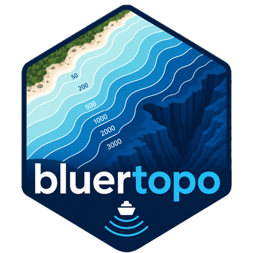

# bluertopo



[](https://github.com/el-cordero/bluer-topo/actions/workflows/R-CMD-check.yaml)
[](https://github.com/el-cordero/bluer-topo/actions/workflows/pkgdown.yaml)
[](https://github.com/el-cordero/bluer-topo/blob/main/LICENSE.md)

`bluertopo` discovers, downloads, verifies, and opens NOAA BlueTopo
bathymetry for an area of interest using `terra`. The package keeps
source GeoTIFF and RAT sidecar files intact by default, records query
and catalog provenance, and makes native source-resolution choices
explicit.

BlueTopo is not for navigation. This package performs no vertical-datum
conversion and is not affiliated with, endorsed by, or supported by
NOAA.

Reference: NOAA,
[BlueTopo](https://nauticalcharts.noaa.gov/data/bluetopo.html) and
[BlueTopo
specifications](https://nauticalcharts.noaa.gov/data/bluetopo_specs.html).

## Real NOAA Proof

Example AOI: New York Harbor, centered on Lower Manhattan, the Upper
Bay, Governors Island, and the East River mouth. This homepage proof
uses actual NOAA BlueTopo source tiles downloaded during the pkgdown
build.


Actual NOAA BlueTopo source data: New York Harbor elevation with
hillshade, contours, and AOI outline.

| tile_id  | resolution_m | utm_zone | intersection_fraction | selection_reason |
|:---------|-------------:|:---------|----------------------:|:-----------------|
| BH4XC5FK |            4 | 18       |                 0.142 | native           |
| BH4XD5FK |            4 | 18       |                 0.213 | native           |

| tile_id  | asset_type | status          | verified | downloaded_mb | actual_sha256 |
|:---------|:-----------|:----------------|:---------|--------------:|:--------------|
| BH4XC5FK | geotiff    | reused_verified | TRUE     |         5.393 | 878be33a85f5  |
| BH4XC5FK | rat        | reused_verified | TRUE     |         0.104 | 21405b45e162  |
| BH4XD5FK | geotiff    | reused_verified | TRUE     |         4.093 | 35174b851869  |
| BH4XD5FK | rat        | reused_verified | TRUE     |         0.067 | 59814a3e330c  |

## Basic Workflow

``` r

library(bluertopo)
library(terra)

aoi <- vect("my_area.gpkg")
bathy <- bluertopo(aoi)
plot(bathy)
```

## Provenance Workflow

``` r

result <- bluertopo(aoi, details = TRUE)

result$tiles
result$downloads
result$coverage
result$provenance
```

## Examples

The [Examples
tab](https://el-cordero.github.io/bluer-topo/articles/examples.md) is
rendered from actual NOAA BlueTopo source tiles for New York Harbor.
Normal package tests use small synthetic fixtures so checks remain
network-free. The mixed-grid example uses a documented secondary real
AOI near Key West and Boca Chica Channel because the current New York
Harbor plan is one compatible 4 m native grid.

- [Example
  gallery](https://el-cordero.github.io/bluer-topo/articles/examples.md)
- [Discover tiles and
  coverage](https://el-cordero.github.io/bluer-topo/articles/example-discover-tiles.md)
- [Download original
  assets](https://el-cordero.github.io/bluer-topo/articles/example-download-assets.md)
- [Extract elevation with
  terra](https://el-cordero.github.io/bluer-topo/articles/example-extract-elevation.md)
- [Compare resolution
  policies](https://el-cordero.github.io/bluer-topo/articles/example-resolution-policies.md)
- [Mixed grids and output
  grid](https://el-cordero.github.io/bluer-topo/articles/example-mixed-grids.md)
- [Layers and RAT
  metadata](https://el-cordero.github.io/bluer-topo/articles/example-layers-rat.md)
